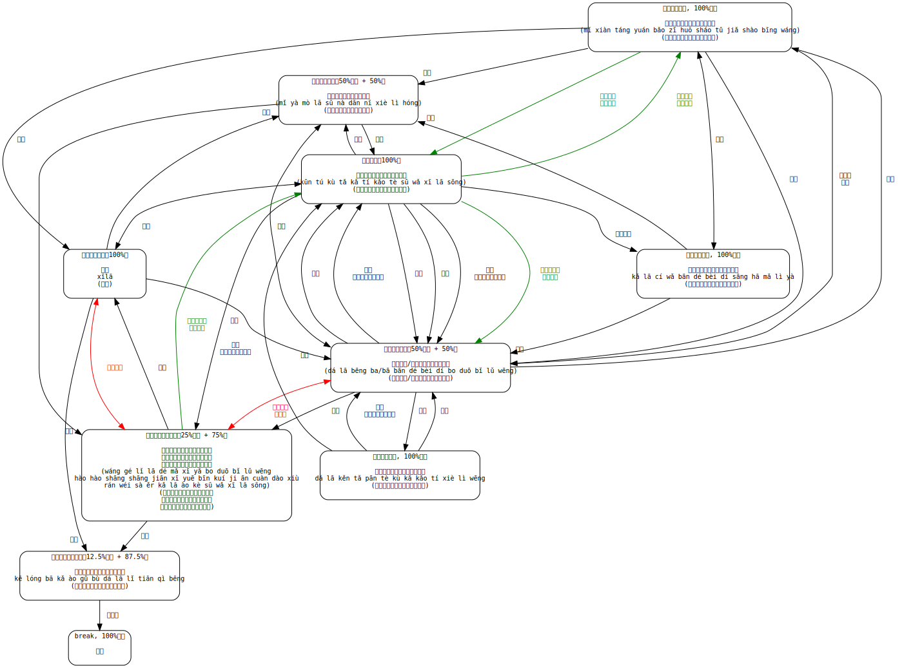

# 达拉崩吧人物关系图

达拉崩吧是2017年在B站上很火的一个系列。原作者[ilem](https://space.bilibili.com/3379951)做了一个[原创的Vocaloid视频](https://www.bilibili.com/video/av9372087/)，说的是一个老掉牙的勇者斗恶龙救公主的故事。却因为主角勇者和恶龙的名字非常长而带感且歌曲洗脑而红遍B站，并衍生了大量二次创作，令一个老土的故事发展成为大规模家庭伦理X各种互绿X魔幻/科幻片。现在此曲已经获得[Vocaloid中文传说曲的称号](https://zh.moegirl.org/zh-hans/%E8%BE%BE%E6%8B%89%E5%B4%A9%E5%90%A7)。

本项目意在稍微整理一下各种复杂的人物关系，并且练习一下Graphviz。

P.S. 图里我加了繁体，REMDME就算了。另外我也不懂注音。粤语我会说，但是我不会粤拼。

主要参考了以下视频：

* 本家 [av9372087](https://www.bilibili.com/video/av9372087/)
* 巨龙视角 [av9540078](https://www.bilibili.com/video/av9540078/)
* 公主视角 [av9710232](https://www.bilibili.com/video/av9710232/)
* 国王视角 [av9868285](https://www.bilibili.com/video/av9868285/)
* 王浩然视角 [av9878039](https://www.bilibili.com/video/av9878039/)
* 母龙视角 [av10055561](https://www.bilibili.com/video/av10055561/)
* 续集（小弟视角） [av9787250](https://www.bilibili.com/video/av9787250/)
* 王后视角 [av10140978](https://www.bilibili.com/video/av10140978/)
* break视角 [av11079221](https://www.bilibili.com/video/av11079221/)

# 超级乱的关系图，各种绿，各种伦

# 一些名字的集合

因为本系列大家都来玩名字<ruby>哏<rp>(</rp><rt>gén</rt><rp>)</rp></ruby>（现在多用梗字），所用都超长超难念超难记的，在此附上一些（山洞和城堡我就不弄了）。

拼音为机器转换的，若有差错，欢迎PR。

* 达拉崩吧：
<ruby>达<rp>(</rp><rt>dá</rt><rp>(</rp></ruby><ruby>拉<rp>(</rp><rt>lā</rt><rp>(</rp></ruby><ruby>崩<rp>(</rp><rt>bēng</rt><rp>(</rp></ruby><ruby>吧/<rp>(</rp><rt>ba</rt><rp>(</rp></ruby><ruby>巴<rp>(</rp><rt>bā</rt><rp>(</rp></ruby><ruby>斑<rp>(</rp><rt>bān</rt><rp>(</rp></ruby><ruby>得<rp>(</rp><rt>dé</rt><rp>(</rp></ruby><ruby>贝<rp>(</rp><rt>bèi</rt><rp>(</rp></ruby><ruby>迪<rp>(</rp><rt>dí</rt><rp>(</rp></ruby><ruby>卜<rp>(</rp><rt>bo</rt><rp>(</rp></ruby><ruby>多<rp>(</rp><rt>duō</rt><rp>(</rp></ruby><ruby>比<rp>(</rp><rt>bǐ</rt><rp>(</rp></ruby><ruby>鲁<rp>(</rp><rt>lǔ</rt><rp>(</rp></ruby><ruby>翁<rp>(</rp><rt>wēng</rt><rp>(</rp></ruby>

* 公主：
<ruby>米<rp>(</rp><rt>mǐ</rt><rp>(</rp></ruby><ruby>娅<rp>(</rp><rt>yà</rt><rp>(</rp></ruby><ruby>莫<rp>(</rp><rt>mò</rt><rp>(</rp></ruby><ruby>拉<rp>(</rp><rt>lā</rt><rp>(</rp></ruby><ruby>苏<rp>(</rp><rt>sū</rt><rp>(</rp></ruby><ruby>娜<rp>(</rp><rt>nà</rt><rp>(</rp></ruby><ruby>丹<rp>(</rp><rt>dān</rt><rp>(</rp></ruby><ruby>妮<rp>(</rp><rt>nī</rt><rp>(</rp></ruby><ruby>谢<rp>(</rp><rt>xiè</rt><rp>(</rp></ruby><ruby>莉<rp>(</rp><rt>lì</rt><rp>(</rp></ruby><ruby>红<rp>(</rp><rt>hóng</rt><rp>(</rp></ruby>

* 巨龙：
<ruby>昆<rp>(</rp><rt>kūn</rt><rp>(</rp></ruby><ruby>图<rp>(</rp><rt>tú</rt><rp>(</rp></ruby><ruby>库<rp>(</rp><rt>kù</rt><rp>(</rp></ruby><ruby>塔<rp>(</rp><rt>tǎ</rt><rp>(</rp></ruby><ruby>卡<rp>(</rp><rt>kǎ</rt><rp>(</rp></ruby><ruby>提<rp>(</rp><rt>tí</rt><rp>(</rp></ruby><ruby>考<rp>(</rp><rt>kǎo</rt><rp>(</rp></ruby><ruby>特<rp>(</rp><rt>tè</rt><rp>(</rp></ruby><ruby>苏<rp>(</rp><rt>sū</rt><rp>(</rp></ruby><ruby>瓦<rp>(</rp><rt>wǎ</rt><rp>(</rp></ruby><ruby>西<rp>(</rp><rt>xī</rt><rp>(</rp></ruby><ruby>拉<rp>(</rp><rt>lā</rt><rp>(</rp></ruby><ruby>松<rp>(</rp><rt>sōng</rt><rp>(</rp></ruby>

* 国王：
<ruby>米<rp>(</rp><rt>mǐ</rt><rp>(</rp></ruby><ruby>现<rp>(</rp><rt>xiàn</rt><rp>(</rp></ruby><ruby>唐<rp>(</rp><rt>táng</rt><rp>(</rp></ruby><ruby>元<rp>(</rp><rt>yuán</rt><rp>(</rp></ruby><ruby>保<rp>(</rp><rt>bǎo</rt><rp>(</rp></ruby><ruby>兹<rp>(</rp><rt>zī</rt><rp>(</rp></ruby><ruby>火<rp>(</rp><rt>huǒ</rt><rp>(</rp></ruby><ruby>勺<rp>(</rp><rt>sháo</rt><rp>(</rp></ruby><ruby>吐<rp>(</rp><rt>tǔ</rt><rp>(</rp></ruby><ruby>假<rp>(</rp><rt>jiǎ</rt><rp>(</rp></ruby><ruby>绍<rp>(</rp><rt>shào</rt><rp>(</rp></ruby><ruby>兵<rp>(</rp><rt>bīng</rt><rp>(</rp></ruby><ruby>王<rp>(</rp><rt>wáng</rt><rp>(</rp></ruby>

* 王浩然：
rp><rt>dé</rt><rp>(</rp></ruby><ruby>玛<rp>(</rp><rt>mǎ</rt><rp>(</rp></ruby><ruby>西<rp>(</rp><rt>xī</rt><rp>(</rp></ruby><ruby>亚<rp>(</rp><rt>yǎ</rt><rp>(</rp></ruby><ruby>卜<rp>(</rp><rt>bo</rt><rp>(</rp></ruby><ruby>多<rp>(</rp><rt>duō</rt><rp>(</rp></ruby><ruby>比<rp>(</rp><rt>bǐ</rt><rp>(</rp></ruby><ruby>鲁<rp>(</rp><rt>lǔ</rt><rp>(</rp></ruby><ruby>翁<rp>(</rp><rt>wēng</rt><rp>(</rp></ruby><ruby>浩<rp>(</rp><rt>hào</rt><rp>(</rp></ruby><ruby>淏<rp>(</rp><rt>hào</rt><rp>(</rp></ruby><ruby>殇<rp>(</rp><rt>shāng</rt><rp>(</rp></ruby><ruby>觞<rp>(</rp><rt>shāng</rt><rp>(</rp></ruby><ruby>笺<rp>(</rp><rt>jiān</rt><rp>(</rp></ruby><ruby>酅<rp>(</rp><rt>xī</rt><rp>(</rp></ruby><ruby>彟<rp>(</rp><rt>yuē</rt><rp>(</rp></ruby><ruby>豳<rp>(</rp><rt>bīn</rt><rp>(</rp></ruby><ruby>夔<rp>(</rp><rt>kuí</rt><rp>(</rp></ruby><ruby>櫼<rp>(</rp><rt>ji</rt><rp>(</rp></ruby><ruby>爨<rp>(</rp><rt>ān</rt><rp>(</rp></ruby><ruby>纛<rp>(</rp><rt>cuàn</rt><rp>(</rp></ruby><ruby>褎<rp>(</rp><rt>dào</rt><rp>(</rp></ruby><ruby>然<rp>(</rp><rt>xiù</rt><rp>(</rp></ruby><ruby>维<rp>(</rp><rt>rán</rt><rp>(</rp></ruby><ruby>萨<rp>(</rp><rt>wéi</rt><rp>(</rp></ruby><ruby>尔<rp>(</rp><rt>sà</rt><rp>(</rp></ruby><ruby>卡<rp>(</rp><rt>ěr</rt><rp>(</rp></ruby><ruby>拉<rp>(</rp><rt>kǎ</rt><rp>(</rp></ruby><ruby>奥<rp>(</rp><rt>lā</rt><rp>(</rp></ruby><ruby>克<rp>(</rp><rt>ào</rt><rp>(</rp></ruby><ruby>苏<rp>(</rp><rt>kè</rt><rp>(</rp></ruby><ruby>瓦<rp>(</rp><rt>sū</rt><rp>(</rp></ruby><ruby>西<rp>(</rp><rt>wǎ</rt><rp>(</rp></ruby><ruby>拉<rp>(</rp><rt>xī</rt><rp>(</rp></ruby><ruby>松<rp>(</rp><rt>lā</rt><rp>(</rp></ruby>

* 女王：
<ruby>卡<rp>(</rp><rt>kǎ</rt><rp>(</rp></ruby><ruby>拉<rp>(</rp><rt>lā</rt><rp>(</rp></ruby><ruby>茨<rp>(</rp><rt>cí</rt><rp>(</rp></ruby><ruby>瓦<rp>(</rp><rt>wǎ</rt><rp>(</rp></ruby><ruby>般<rp>(</rp><rt>bān</rt><rp>(</rp></ruby><ruby>得<rp>(</rp><rt>dé</rt><rp>(</rp></ruby><ruby>贝<rp>(</rp><rt>bèi</rt><rp>(</rp></ruby><ruby>荻<rp>(</rp><rt>dí</rt><rp>(</rp></ruby><ruby>桑<rp>(</rp><rt>sāng</rt><rp>(</rp></ruby><ruby>哈<rp>(</rp><rt>hā</rt><rp>(</rp></ruby><ruby>玛<rp>(</rp><rt>mǎ</rt><rp>(</rp></ruby><ruby>丽<rp>(</rp><rt>lì</rt><rp>(</rp></ruby><ruby>亚<rp>(</rp><rt>yà</rt><rp>(</rp></ruby>

* 龙傲天：
<ruby>科<rp>(</rp><rt>kē</rt><rp>(</rp></ruby><ruby>龙<rp>(</rp><rt>lóng</rt><rp>(</rp></ruby><ruby>巴<rp>(</rp><rt>bā</rt><rp>(</rp></ruby><ruby>卡<rp>(</rp><rt>kǎ</rt><rp>(</rp></ruby><ruby>傲<rp>(</rp><rt>ào</rt><rp>(</rp></ruby><ruby>骨<rp>(</rp><rt>gǔ</rt><rp>(</rp></ruby><ruby>布<rp>(</rp><rt>bù</rt><rp>(</rp></ruby><ruby>达<rp>(</rp><rt>dá</rt><rp>(</rp></ruby><ruby>拉<rp>(</rp><rt>lā</rt><rp>(</rp></ruby><ruby>里<rp>(</rp><rt>lǐ</rt><rp>(</rp></ruby><ruby>天<rp>(</rp><rt>tiān</rt><rp>(</rp></ruby><ruby>气<rp>(</rp><rt>qì</rt><rp>(</rp></ruby><ruby>崩<rp>(</rp><rt>bēng</rt><rp>(</rp></ruby>

* 小弟：
<ruby>达<rp>(</rp><rt>dá</rt><rp>(</rp></ruby><ruby>拉<rp>(</rp><rt>lā</rt><rp>(</rp></ruby><ruby>肯<rp>(</rp><rt>kěn</rt><rp>(</rp></ruby><ruby>塔<rp>(</rp><rt>tǎ</rt><rp>(</rp></ruby><ruby>潘<rp>(</rp><rt>pān</rt><rp>(</rp></ruby><ruby>特<rp>(</rp><rt>tè</rt><rp>(</rp></ruby><ruby>库<rp>(</rp><rt>kù</rt><rp>(</rp></ruby><ruby>卡<rp>(</rp><rt>kǎ</rt><rp>(</rp></ruby><ruby>考<rp>(</rp><rt>kǎo</rt><rp>(</rp></ruby><ruby>提<rp>(</rp><rt>tí</rt><rp>(</rp></ruby><ruby>谢<rp>(</rp><rt>xiè</rt><rp>(</rp></ruby><ruby>利<rp>(</rp><rt>lì</rt><rp>(</rp></ruby><ruby>翁<rp>(</rp><rt>wēng</rt><rp>(</rp></ruby>

# 协议
MIT。希望大家玩得开心，不要自己绿自己。